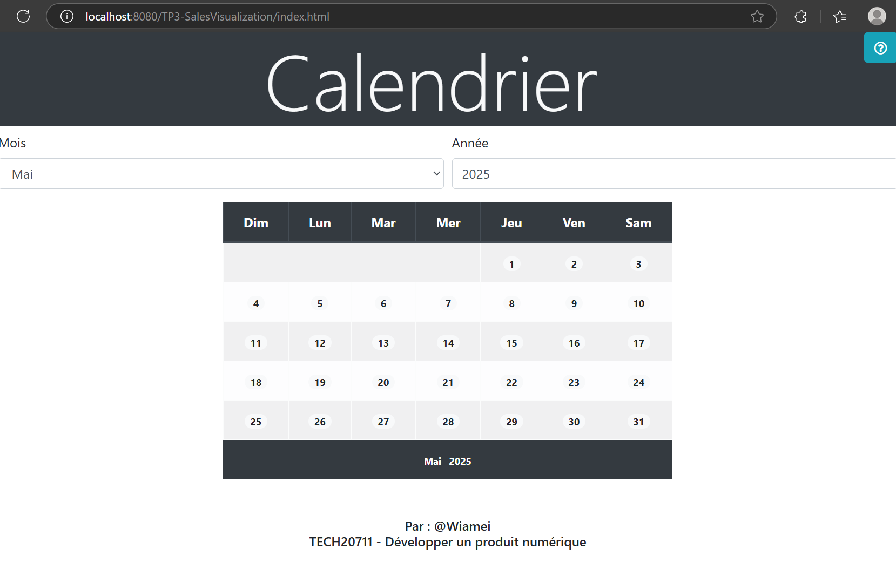
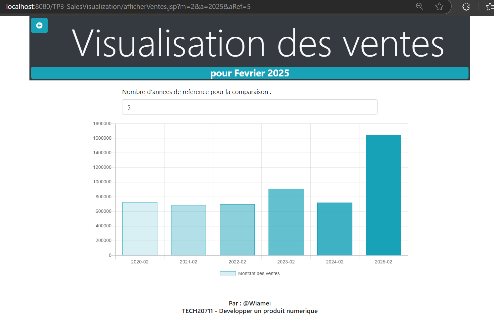
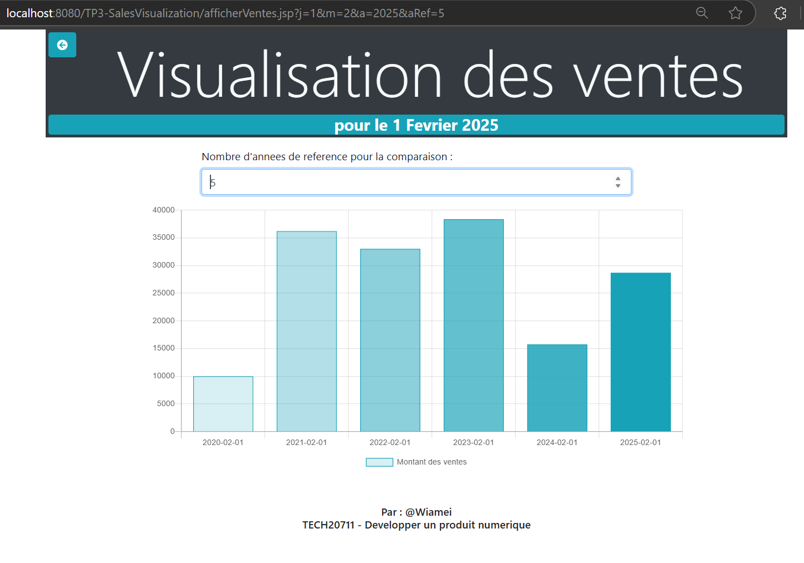
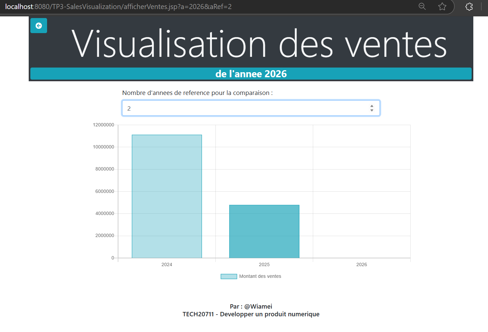
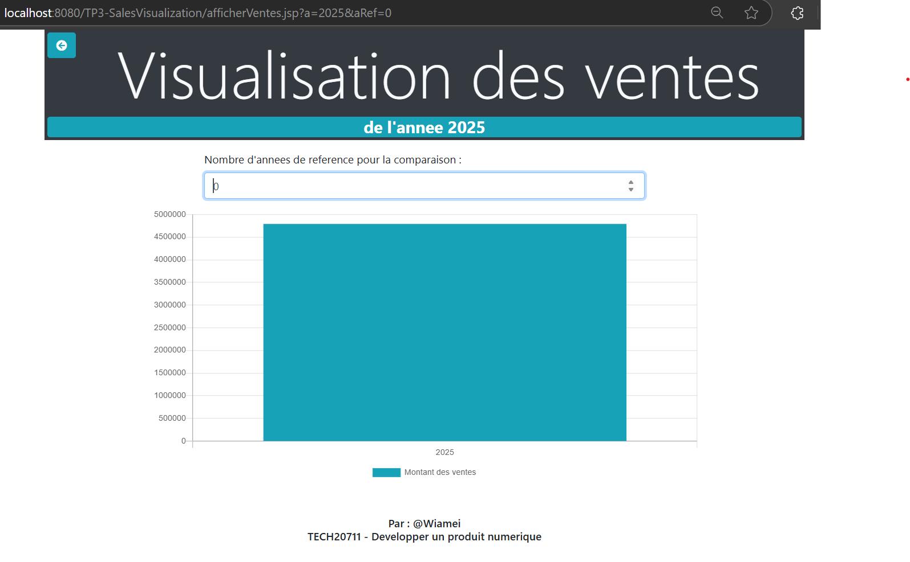

# Visualisation dynamique des ventes

Projet académique réalisé dans le cadre du cours *TECH20711 – Développer un produit numérique* à HEC Montréal.

## Objectif

Cette application web permet à un utilisateur de sélectionner une date, un mois ou une année à partir d’un calendrier dynamique, et de visualiser les ventes correspondantes sous forme de graphique interactif. Les ventes sont automatiquement comparées aux années précédentes (par défaut 3 ans).

## Fonctionnalités

- Calendrier dynamique : sélection d’une date, d’un mois ou d’une année.
- Visualisation des ventes avec Chart.js :
  - Comparaison interannuelle.
  - Adaptation automatique à la granularité choisie (jour, mois ou année).
- Lecture de fichiers structurés : traitement du fichier `ventes.log`.
- Agrégation des ventes selon la période choisie.
- Traitement des dates sans ventes (ajout de dates manquantes pour un affichage cohérent).

## Technologies utilisées

| Côté client        | Côté serveur              |
|--------------------|---------------------------|
| HTML/CSS           | JSP (Java Server Pages)   |
| JavaScript (DOM)   | Java Servlet / JSTL       |
| Chart.js           | Lecture de fichiers texte |

## Structure du projet
projet-ventes/
├── index.html # Interface principale avec le calendrier
├── afficherVentes.jsp # Génère dynamiquement les graphiques de ventes
├── data/
│ └── ventes.log # Fichier de données structurées (historique des ventes)
├── js/ # Scripts JavaScript liés au calendrier
├── README.md 

## Modéles d'exécution

##  Lancer l’application localement
1. Cloner ce dépôt :
    git clone https://github.com/wiamei/sales-visualization-calendar-jsp.git
   
3. Ouvrir le projet dans un IDE Java (comme Eclipse) et le configurer comme projet Dynamic Web Project.
4. Déployer l’application sur un serveur local comme Apache Tomcat.
5. Accéder à http://localhost:8080/projet-ventes/index.html dans votre navigateur.

